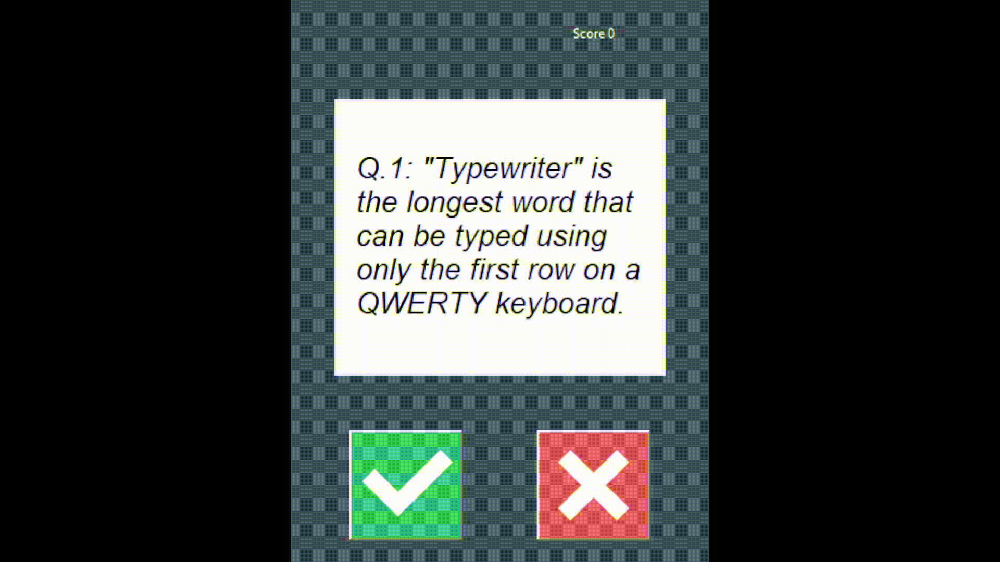

# python-gui-quiz-app
A basic quiz app created in python, with questions supplied by the Open Trivia Database (opentdb.com).

## Demonstration



Python has introduced me to the OOP(Object Oriented Programming) paradigm, which I've only briefly touched upon during my journey with JavaScript.

## Learnings from completing this project

- Calling an API (opentdb.com)
- Class-based programming
- Separation of concerns - maintaing pure functionality
- Using Tk Interface to:
  - Create a canvas
  - Draw question text on it
  - Use a grid layout
  - Display images for true/false answers
  - Update the display background to confirm whether the user answers correctly

## Challenges faced

- Once I had completed the quiz logic in main.py, it was a big challenge to then be able to abstract it, whilst still ensuring all the components talked to each other.
- Navigating the data received from the API
- Creating the layout in tkinter can be fiddly

## Using the app

[Clone down](https://docs.github.com/en/desktop/contributing-and-collaborating-using-github-desktop/adding-and-cloning-repositories/cloning-and-forking-repositories-from-github-desktop) the folder from GitHub into your IDE.
Change directory in to the root folder.
You will need to install the requests module as it does not come pre-bundled with python. For PyCharm, [see here](https://www.jetbrains.com/help/pycharm/installing-uninstalling-and-upgrading-packages.html#packages-tool-window). In VS Code, enter this command at the root level of the project: 
```python
pip3 install requests
```
Then run main.py.
